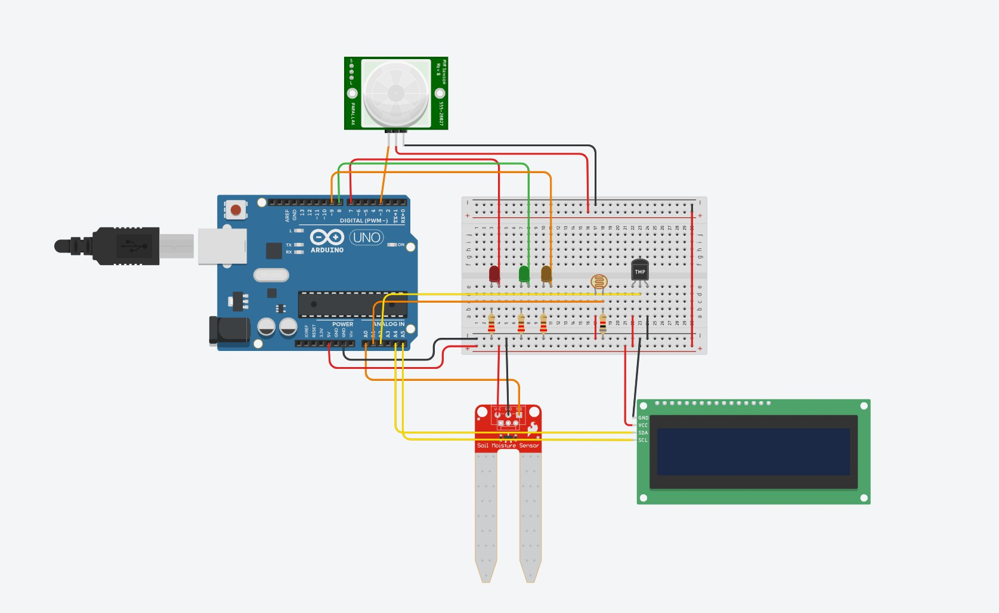

# 🌱 🪴 The Guardian Project: Smart Plant Monitoring System 🪴 🌱

## ✨ Overview: Never Let Your Plants Wilt Again!

### Welcome to "The Guardian Project," an Arduino-based smart monitoring system designed for comprehensive plant health tracking. This system utilizes a dual-sensing approach—combining analog (moisture, light, temperature) and digital (PIR motion) sensors—to continuously analyze the plant's environment. The goal is to shift plant care from guesswork to a data-driven, automated process.
The system provides immediate feedback through an LCD display and LED indicators, alerting the user to critical conditions like low water, unsuitable temperature, or motion detection.


## ⚙️ Core Hardware Components:
### This project combines several crucial components to enable robust environmental sensing.

| Component | Type | Function and Purpose |
|---|---|---|
| Arduino UNO | Microcontroller | Processes data and runs the control logic. |
| Soil Moisture Sensor | Analog | Measures water percentage to determine hydration needs. |
| Photoresistor (LDR) | Analog | Measures ambient light intensity. |
| Temperature Sensor (Analog) | Analog | Measures ambient temperature suitability. |
| PIR Motion Sensor | Digital | Detects surrounding motion (added security layer). |
| LCD 16x2 (I2C) | Output | Provides immediate, human-readable status updates. |
| LEDs (R, G, O) | Output | Green = OK, Red = Alert, Orange = Motion. |




## 🧠 Code Logic and Operation (How It Works)
The software implements a robust logic to evaluate the plant's status based on predefined ideal ranges:
 * Dual Acquisition: Reads data from all four sensors.
 * Scaling: Analog readings are mapped to percentages (0-100%) for easy comparison.
 * Priority Alert System: The system prioritizes immediate security alerts (Motion) over environmental warnings (Health).
 * Threshold Logic: LEDs and LCD alerts are triggered when readings (especially moisture and temperature) fall outside the safe zone.
> Key Thresholds Defined in the Code:
>  * Moisture: Needs water if below 30%.
>  * Temperature: Needs attention if below 30% or above 60% (approx. 7.5°C to 15°C).
>  * Light: Needs attention if below 30% or above 70%.

## 💻 Arduino Code (plant_monitor.ino)
### This is the complete Arduino C++ code used to interface with the sensors and control the outputs.

```
#include <Wire.h>
#include <LiquidCrystal_I2C.h>

// Sensor Definitions
const int moistureSensor = A0;
const int lightSensor = A1;  
const int tempSensor = A2;
const int pirSensor = 3;
const int redLED = 7;
const int greenLED = 8;
const int orangeLED = 9;

// Global Variables
int moistureValue = 0;
int lightValue = 0;
int tempValue = 0;
bool motionDetected = false;
float temperatureC = 0;
int tempPercentage = 0;

// LCD Setup (using address 0x20 for PCF8574)
LiquidCrystal_I2C lcd(0x20, 16, 2);

void setup() {
  pinMode(moistureSensor, INPUT);
  pinMode(lightSensor, INPUT);
  pinMode(tempSensor, INPUT);
  pinMode(pirSensor, INPUT);
  pinMode(redLED, OUTPUT);
  pinMode(greenLED, OUTPUT);
  pinMode(orangeLED, OUTPUT);
  
  Serial.begin(9600);
  
  lcd.init();
  lcd.backlight();
  
  lcd.setCursor(0, 0);
  lcd.print("System Ready");
  lcd.setCursor(0, 1);
  lcd.print("Monitoring...");
  
  delay(2000);
  lcd.clear();
}

void loop() {
  readAllSensors();
  controlLEDs();
  displayStatusOnLCD();
  displayOnSerial();
  
  delay(2000);
}

void readAllSensors() {
  moistureValue = analogRead(moistureSensor);
  lightValue = analogRead(lightSensor);
  
  tempValue = analogRead(tempSensor);
  temperatureC = (tempValue * 5.0 / 1024.0) * 100;
  
  // Map 0-25°C to 0-100% for simplified logic
  tempPercentage = map(temperatureC, 0, 25, 0, 100);
  
  motionDetected = digitalRead(pirSensor);
}

void controlLEDs() {
  int moisturePercentage = map(moistureValue, 0, 1023, 0, 100);
  int lightPercentage = map(lightValue, 0, 1023, 0, 100);
  
  // Orange LED for Motion
digitalWrite(orangeLED, motionDetected ? HIGH : LOW);
  
  // Red/Green LED for Plant Health
  bool plantNeedsAttention = false;
  
  if (moisturePercentage < 30) {
    plantNeedsAttention = true;
  } else if (tempPercentage < 30 || tempPercentage > 60) {
    plantNeedsAttention = true;
  } else if (lightPercentage < 30 || lightPercentage > 70) {
    plantNeedsAttention = true;
  }
  
  if (plantNeedsAttention) {
    digitalWrite(redLED, HIGH);
    digitalWrite(greenLED, LOW);
  } else {
    digitalWrite(redLED, LOW);
    digitalWrite(greenLED, HIGH);
  }
}

void displayStatusOnLCD() {
  int moisturePercentage = map(moistureValue, 0, 1023, 0, 100);
  int lightPercentage = map(lightValue, 0, 1023, 0, 100);
  
  lcd.clear();
  
  String statusLine1 = "";
  String statusLine2 = "";
  
  if (motionDetected) {
    statusLine1 = "MOTION DETECTED";
    statusLine2 = "CHECK AREA";
  } else if (moisturePercentage < 30) {
    statusLine1 = "NEED WATER";
    statusLine2 = "CHECK PLANT";
  } else if (tempPercentage < 30) {
    statusLine1 = "TOO COLD";
    statusLine2 = "CHECK PLANT";
  } else if (tempPercentage > 60) {
    statusLine1 = "TOO HOT";
    statusLine2 = "CHECK PLANT";
  } else if (lightPercentage < 30) {
    statusLine1 = "TOO DARK";
    statusLine2 = "CHECK PLANT";
  } else if (lightPercentage > 70) {
    statusLine1 = "TOO BRIGHT";
    statusLine2 = "CHECK PLANT";
  } else {
    statusLine1 = "ALL GOOD";
    statusLine2 = "SYSTEM OK";
  }
  
  lcd.setCursor(0, 0);
  lcd.print(statusLine1);
  
  lcd.setCursor(0, 1);
  lcd.print(statusLine2);
}

void displayOnSerial() {
  int moisturePercentage = map(moistureValue, 0, 1023, 0, 100);
  int lightPercentage = map(lightValue, 0, 1023, 0, 100);
  
  Serial.println("========== SENSOR READINGS ==========");
  Serial.print("Moisture: ");
  Serial.print(moisturePercentage);
  Serial.println("%");
  
  Serial.print("Light: ");
  Serial.print(lightPercentage);
  Serial.println("%");

  Serial.print("Temperature: ");
  Serial.print(temperatureC, 1);
  Serial.print("C (");
  Serial.print(tempPercentage);
  Serial.println("%)");
  
  Serial.print("Motion: ");
  Serial.println(motionDetected ? "DETECTED" : "NONE");
  
  Serial.print("STATUS: ");
  
  if (motionDetected) {
    Serial.println("MOTION DETECTED - CHECK AREA");
  } else if (moisturePercentage < 30) {
    Serial.println("NEED WATER - CHECK PLANT");
  } else if (tempPercentage < 30) {
    Serial.println("TOO COLD - CHECK PLANT");
  } else if (tempPercentage > 60) {
    Serial.println("TOO HOT - CHECK PLANT");
  } else if (lightPercentage < 30) {
    Serial.println("TOO DARK - CHECK PLANT");
  } else if (lightPercentage > 70) {
    Serial.println("TOO BRIGHT - CHECK PLANT");
  } else {
    Serial.println("ALL GOOD - SYSTEM OK");
  }
  
  Serial.println("IDEAL RANGES:");
  Serial.println("- Temperature: 30%-60% (approx. 7.5C-15C)");
  Serial.println("- Light: 30% - 70%");
  Serial.println("- Moisture: 30% - 100%");
  
  Serial.println("======================================");
}
```
## 🚀 Suggested Future Improvements
### To make this project even more powerful and useful:
 * Wireless Connectivity: Integrate a Wi-Fi module (like ESP8266) to send data to a cloud platform for remote monitoring.
 * Automated Actuation: Add a small water pump and use the moisture alerts to create a fully automatic irrigation system.
 * Data Logging: Implement an SD card module to log historical data, enabling long-term analysis of environmental trends.


